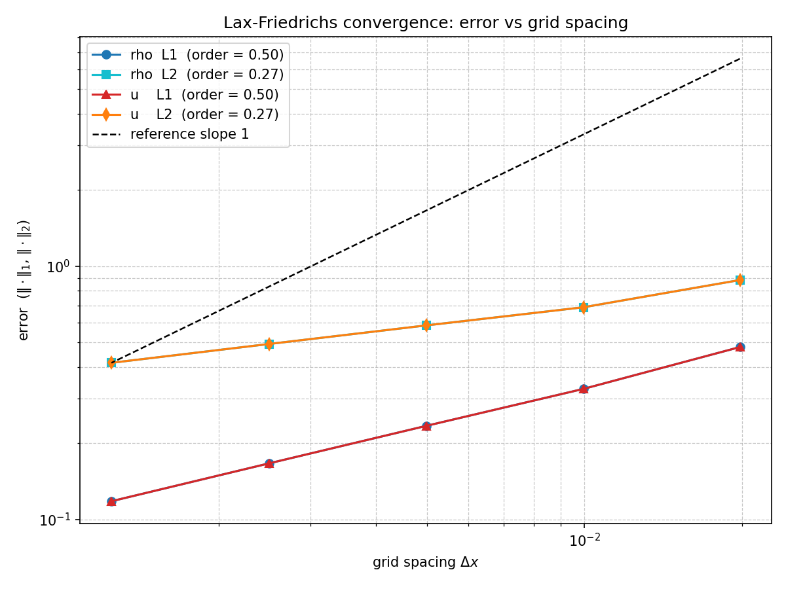

# 1D Linear Advection System — Lax–Friedrichs Scheme

A small, self-contained computational-physics project that solves a coupled
linear hyperbolic PDE system with the **Lax–Friedrichs** finite-difference
scheme, validates it against an exact analytical solution, and quantifies the
scheme's **order of accuracy** with a grid-refinement convergence study.

---

## Problem statement

We solve the coupled system on the domain $x \in [-1, 1]$:

$$
\frac{\partial \rho}{\partial t} + \frac{\partial u}{\partial x} = 0
\qquad\qquad
\frac{\partial u}{\partial t} + \frac{\partial \rho}{\partial x} = 0
$$

Here $\rho$ is a density-like variable and $u$ a velocity-like variable. The
initial condition is a **Riemann problem** — a single discontinuity at $x = 0$:

$$
(\rho,\ u) = (0.1,\ 2.0) \ \text{ for } x \le 0,
\qquad
(\rho,\ u) = (10.0,\ 1.0) \ \text{ for } x > 0,
$$

with **Neumann (zero-gradient)** boundary conditions at both ends.

### Exact solution

The system decouples under the **Riemann invariants** $w_1 = \rho + u$ and
$w_2 = \rho - u$, which satisfy two independent linear advection equations with
wave speeds $c = +1$ and $c = -1$ respectively. Each invariant is transported at
constant speed without changing shape,

$$
w_1(x, t) = w_1^0(x - t), \qquad w_2(x, t) = w_2^0(x + t),
$$

so the initial jump splits into a right-moving and a left-moving wave. The
primitive variables are recovered from
$\rho = \tfrac12(w_1 + w_2)$, $u = \tfrac12(w_1 - w_2)$. This exact solution is
what the numerical scheme is validated against.

---

## Numerical method

Writing the system as $U_t + F(U)_x = 0$ with $U = (\rho, u)$ and flux
$F(U) = (u, \rho)$, the **Lax–Friedrichs** update for interior node $i$ is

$$
U_i^{\,n+1} = \tfrac12\left(U_{i+1}^n + U_{i-1}^n\right)
- \frac{\Delta t}{2\,\Delta x}\left(F_{i+1}^n - F_{i-1}^n\right),
$$

i.e. neighbour-averaging plus a centred flux difference with coefficient
$a = \Delta t/(2\,\Delta x)$. The averaging term supplies the numerical
diffusion that stabilises the scheme (at the cost of smearing discontinuities).
Lax–Friedrichs is **first-order accurate**.

### The Courant (CFL) condition

Stability is governed by the **Courant number**

$$
C = \frac{|c|\,\Delta t}{\Delta x},
$$

the number of grid cells a wave crosses per time step. The scheme is stable for
$C \le 1$. The time step is set as $\Delta t = C\,\Delta x$; since the wave
speeds satisfy $|c| = 1$ here, the Courant number equals that ratio exactly and
the scheme coefficient is $a = C/2$. The notebook sweeps $C = 0.4$ (stable),
$C = 1.0$ (marginal, sharpest fronts) and $C = 1.4$ (unstable — the solution
blows up).

---

## Repository layout

```
lax_friedrichs_advection/
├── README.md
├── requirements.txt
├── src/
│   ├── solver.py         # Lax–Friedrichs solver (grid resolution is a parameter)
│   ├── analytical.py     # exact Riemann-invariant solution
│   └── convergence.py    # grid-refinement convergence study
├── notebooks/
│   └── comp_phy_project.ipynb   # runs the experiments and presents results
└── figures/              # saved output plots
```

The reusable numerics live in `src/`; the notebook imports them and focuses on
running experiments and presentation. Grid resolution `nx` is a function
parameter throughout — no function depends on a shared global grid — which is
what makes the convergence study possible.

---

## How to run

```bash
# from the project root
python -m venv .venv && source .venv/bin/activate
pip install -r requirements.txt

# 1. Reproduce the convergence study (prints the error table + fitted order,
#    and saves figures/convergence.png)
python src/convergence.py

# 2. Run the full notebook (comparison, CFL sweep, animation, convergence)
jupyter notebook notebooks/comp_phy_project.ipynb
```

The animation is saved to `figures/` as `.mp4` if `ffmpeg` is installed, and
otherwise as `.gif` (no extra setup needed). See `requirements.txt` for the
optional `ffmpeg` note.

---

## The convergence study

The solver is run at resolutions $n_x = 100, 200, 400, 800, 1600$, each to the
same fixed final time ($t = 0.4$, chosen so both waves stay inside the domain)
and with the same fixed Courant number ($C = 0.8$). The error against the exact
solution is measured in grid-normalised discrete norms,

$$
\|e\|_1 = \Delta x \sum_i |e_i|, \qquad
\|e\|_2 = \sqrt{\Delta x \sum_i e_i^2},
$$

and the order of accuracy is the slope of a log–log fit of error vs $\Delta x$.
The exact solution is evaluated at the *actual* reached time so time-step
rounding does not contaminate the error.



---

## Results summary

- **Validation.** The numerical wave speeds, plateau values and separation of
  the two waves match the exact solution; the only visible discrepancy is the
  expected smearing of the discontinuous fronts.
- **CFL behaviour.** $C = 0.4$ and $C = 1.0$ are stable ($C = 1.0$ giving the
  sharpest fronts); $C = 1.4 > 1$ violates the stability limit and the solution
  blows up — a direct demonstration of the CFL condition.
- **Convergence.** The error decreases monotonically under refinement and the
  log–log data are straight, so the scheme **converges**. The fitted order is
  about **0.5 in $L_1$** and **0.25–0.5 in $L_2$** — *below* the formal
  first-order rate.

  This is expected and reported honestly: Lax–Friedrichs is first-order only for
  **smooth** solutions. Our solution is a Riemann problem with **discontinuities**,
  and convergence is degraded at a shock — the numerical diffusion smears each
  discontinuity over a physical width $\sim \Delta x$, which gives the classic
  $L_1$ rate of $\approx 1/2$ for a monotone first-order scheme (with $L_2$ lower
  still and $L_\infty$ not converging). The accuracy loss is concentrated at the
  shocks, not in the smooth regions; a higher-resolution (slope-limited /
  Godunov-type) scheme would be needed to capture the fronts more sharply.

| $n_x$ | $\Delta x$ | $\rho$ $L_1$ | $\rho$ $L_2$ | $u$ $L_1$ | $u$ $L_2$ |
|------:|-----------:|-------------:|-------------:|----------:|----------:|
|  100  | 0.01980    | 4.80e-01     | 8.82e-01     | 4.80e-01  | 8.82e-01  |
|  200  | 0.00995    | 3.28e-01     | 6.89e-01     | 3.28e-01  | 6.89e-01  |
|  400  | 0.00499    | 2.34e-01     | 5.84e-01     | 2.34e-01  | 5.84e-01  |
|  800  | 0.00250    | 1.67e-01     | 4.93e-01     | 1.67e-01  | 4.93e-01  |
| 1600  | 0.00125    | 1.18e-01     | 4.16e-01     | 1.18e-01  | 4.16e-01  |

Fitted order (log–log slope): $\rho$ — $L_1 = 0.50$, $L_2 = 0.27$; $u$ — identical
by the symmetry of this problem.
